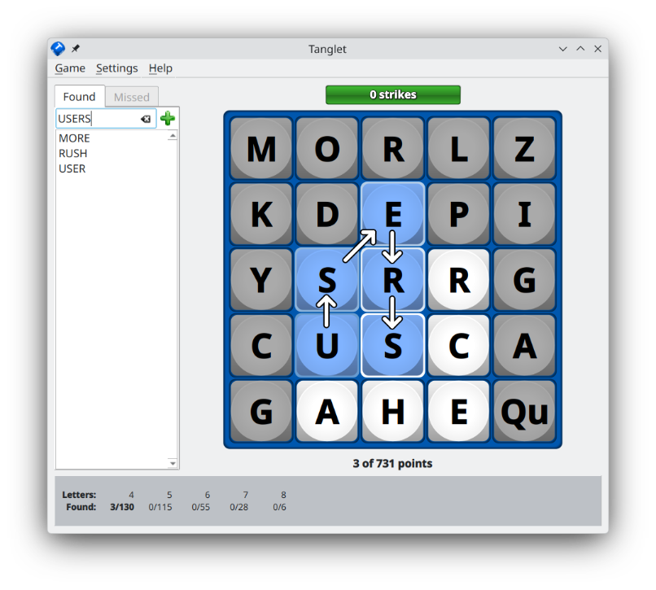

<!-- SPDX-FileCopyrightText: 2026 Graeme Gott <graeme@gottcode.org> -->
<!-- SPDX-License-Identifier: CC-BY-SA-4.0 -->

# How to Play

## Mouse and Keyboard Controls

| Action         | Using the mouse | Using the keyboard |
|----------------|-----------------|--------------------|
| Select a word  | Click on the letters of a word.           | Type the letters of a word. |
| Make a guess   | Click on the last selected letter.        | Press <kbd>Enter</kbd> |
| Erase letters  | Click on an earlier selected letter.      | Press <kbd>Backspace</kbd>. |
| Clear the word | Click twice on the first selected letter. | Press <kbd>Ctrl</kbd> + <kbd>Backspace</kbd>. |

## Activating a Word

If you found a word, click on te first letter. Now you will see around this
field the letters you can choose from to continue the word; all other fields
are grayed out.
     
While entering the letters, the word will be displayed above the word list on
the left.

Once you found a word you think it's valid, double-click on the last activated
letter or press <kbd>Return</kbd>. If **Tanglet** accepts it, it will be
displayed in the list tab **Found** left to the board.

In case you find the word *again* (also in a different letter sequence on the
board), it will be highlighted in this list.

If the word can be extended with one or more letters to form a new one, click
on it to display it again on the board, and you can click on the white fields
to add more letters to create a new word. Note, you earn points for the *whole*
new word, not only for the newly added letters!

If you activate letters using the keyboard or you accidentally press a key with
a letter which is not reachable from the current word end, or even doesn't
exist on the board, the whole board will be grayed out and the field above the
word list will be displayed with a red background.

<!-- I remember, there was such an icon in previous versions... -->
<!-- When you hover the mouse pointer over one of the accepted words in
       the list, a clickable book icon will be displayed, which leads you to
       the appropriate entry in Wiktionary. -->
When the game ends and if you have achieved a place among the top ten in the
chosen game mode, the **High Scores** list appears. Under **Name**, your name
(taken from your user account) is already entered, but highlighted. If you like
to use a different name, or anyone else has played the game, you can change the
name directly, or leave it as-is. In either case, finally click on **Close**.

You can close the game at any time. When closing the game without it has ended,
the same game at the same score will be opened when **Tanglet** starts next
time.

## Show missed words

The wordlist has a tab **Missed**, which is inactive during the game play. When
the game is over, you can click on it to see the words which you haven't found.

## Show high scores

Choose **Game** ➠ **Show High Scores** to open the High Scores list. To switch
between the various game modes, use the vertical tab bar on the left.

## Export or import a game

To export a game, choose **Game** ➠ **Share…**. A file saver dialog opens where
you can type a file name and specify a location where the file will be saved.
Note, the saved file contains only the game properties itself, not your found
words or earned points. See also
[the explanation of the file structure](./files.md#file_structure).

Vice versa, you can choose **Game** ➠ **Choose…**. A file chooser dialog opens
where you can navigate to the desired file and open it.
