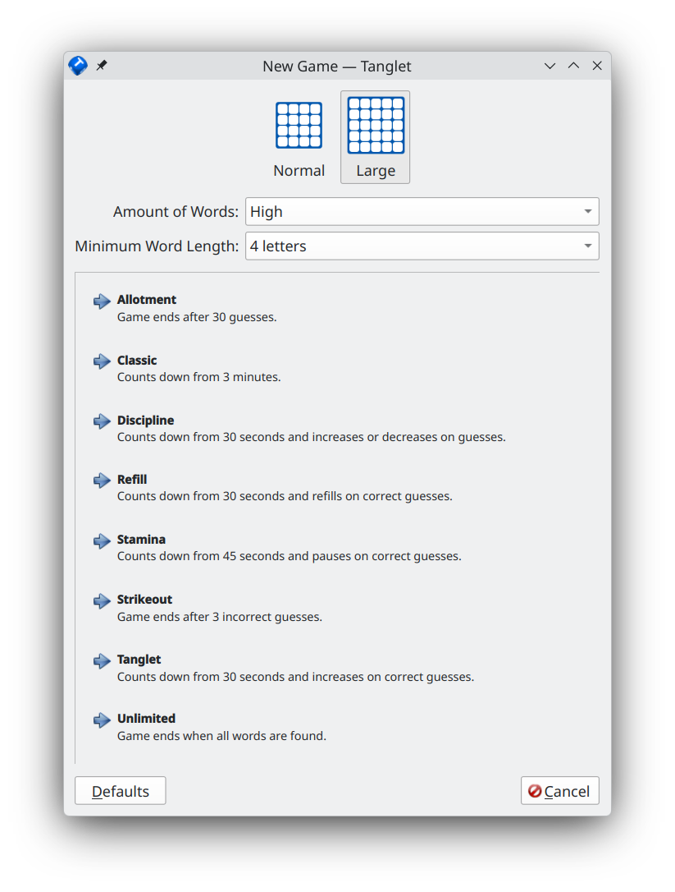

<!-- SPDX-FileCopyrightText: 2026 Graeme Gott <graeme@gottcode.org> -->

# Tanglet user manual

**Tanglet** is a single player word finding game based on
[Boggle](https://en.wikipedia.org/wiki/Boggle). The object of the game is to
list as many words as you can before the time runs out. There are several timer
modes that determine how much time you start with, and if you get extra time
when you find a word.

You can join letters horizontally, vertically, or diagonally in any direction
to make a word, so as long as the letters are next to each other on the board.
However, you can not reuse the same letter cells in a single word. Also, each
word must be at least three letters on a normal board, and four letters on a
large board.

## Starting the game

You can start the game using the application menu of your desktop environment.
Open the application menu and choose **Games** ➠ **Tanglet** or open a quick
start prompt using <kbd>Alt</kbd> + <kbd>F2</kbd> and start typing `tanglet`,
then click on the application name found.

When **Tanglet** starts, two board sizes are available, 4x4 and 5x5. Click on
one of them to apply. In the drop-down list right to **Amount Of Words**, you
can choose between more or less words contained in the board. Try out how it
results in the created word counts in the board, in many cases, with a 5x5
board, you get more than 1000 contained words. The other drop-down list
**Minimum Word Length** lets you choose between acceptable character counts.
The minimally configurable word length depends on the board let's say 5, then
words with 4 letters, which actually exists, won't be accepted by **Tanglet**.

Finally you can choose between different game modes:

The following modes are available:

* **Allotment** – Game ends after 30 guesses.
* **Classic** – Counts down from 3 minutes.
* **Discipline** – Counts down from 30 seconds and increases on correct guesses.
* **Refill** – Counts down from 30 seconds and refills on correct guesses.
* **Stamina** – Counts down from 45 seconds and pauses on correct guesses.
* **Strikeout** – Game ends after 3 incorrect guesses.
* **Tanglet** – Counts down from 30 seconds and increases or decreases on guesses.
* **Unlimited** – Game ends when all words are found.

[How to Play](./howtoplay.md)

[Configuration](./configuration.md)

[Menu Bar Overview](./menubar.md)

[Files](./files.md)

[Contributing](./contributing.md)

[Credits and License](./credits.md)
